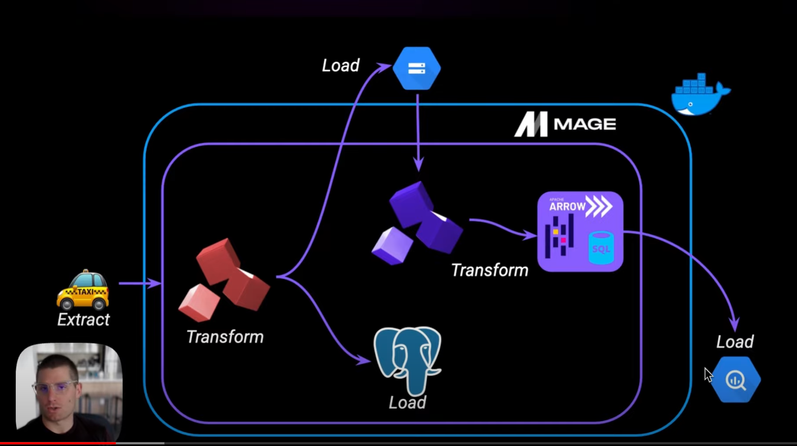

# 02 Workflow Orchrestration


## 2.2.1 What is Orchestration?

Mage & DE Zoomcamp - 🎞️ https://youtu.be/Li8-MWHhTbo?feature=shared

Slides: https://docs.google.com/presentation/d/17zSxG5Z-tidmgY-9l7Al1cPmz4Slh4VPK6o2sryFYvw/



### Architecture
- Extract &rarr; Pluss data from source
- Transform &rarr; Data cleaning, transformation & partitioning
- Load &rarr; API to Mage, Mage to Postgres, GCS, BigQuery


### What is Orchestration?

- Large part of data engineering is extracting, transforming, and laoding data between sources
- Orchestration is the process of automating these steps
- Data orchestrator manages scheduling, trigering, and monitoring and resource allocation


> - Every workflow requires sequential steps
> - Steps are tasks
> - Workflows are DAGs (directed acyclic graphs)

Book: 
Fundamentals of Data Engineering: Plan and Build Robust Data Systems

### What is a good orchestrator/solution?

- Orchestrator handles workflow management
    - Execute tasks in the right order
    - Manage dependencies
    - ...

- Automation
- Error handling & recovery
    - Retrying failed tasks
    - ...
- Recovery
    - Back fill missing data
    - Recover lost data
- Monitoring, alerting
    - Notification
- Resource optimization
- Oberservability
    - Debugging, etc.
- Compliance/Auditing


## 2.2.2 What is Mage?

🎞️ https://youtu.be/AicKRcK3pa4?si=ji4r2laIWX14K3b_

Resources


Slides: https://docs.google.com/presentation/d/1y_5p3sxr6Xh1RqE6N8o2280gUzAdiic2hPhYUUD6l88/


- Mage - Open Source pipeline tool for orchestrating, tracking, and integrating data
- Projects consist of pipelines (DAGs), each pipeline consists of blocks (tasks), blocks are usually used to load, transform, or export data
- Unique blocks of Mage are:
    - Sensors (trigger on events)
    - Conditionals (branching logic, if-else logic, ...)
    - Dynamics (can create dynamic children)
    - Webhooks
    - Data Integration
    - Unified Pipelines
    - Multi-user envs
    - Templating
    - ...


Mage 
- Hybrid environment
    - GUI or pure code
    - Block are testable, reusable pieces of code


- Mage instance has 1 or more projects
- Each project has 1 or more pipelines
- Each pipeline has 1 or more blocks


Pipelines
- Workflows (DAGs) that execute data operations
- Represented by YAML files

Blocks
- Files (Python, SQL, R, ...) that can be executed independently or within a pipeline
- Reusable, atomic pieces of code performing a specific task
- A block is a file &rarr; changing the file changes the block everywhere it is used

Block anatomy
- Imports
- Decorator (e.g. data loader)
- Function (returning a dataframe)
    - Block have to return a dataframe
    - Only this part gets executed when the block is run
- Assertion (or test)


## 2.2.2 - Configure Mage

🎞️ https://youtu.be/2SV-av3L3-k?si=PC_f5RrWtqsTWAK9

Setting up MAGE using GitHub repo (getting started): https://github.com/mage-ai/mage-zoomcamp

- Branch `solution` contains solution: https://github.com/mage-ai/mage-zoomcamp/tree/solutions

1. Rename `dev.env` to `.env`
    - `dev.env` is a template for the `.env` file
    - `.env` might contain secrets and is not committed to GitHub (in `.gitignore`)
1. Build image `docker-compose build`
1. Run image `docker-compose up`
1. Open [http://localhost:6789 ]( http://localhost:6789 )


## 2.2.2 - A Simple Pipeline

🎞️ https://youtu.be/stI-gg4QBnI?si=jV5xtnW5Fsu0rcBD

- Create a new pipeline &rarr; `+ New pipeline` (top left) will create new pipeline
- 
- `Pipelines` overview page, select `Pipelines` in sidebar &rarr; overview of all pipelines


## 2.2.3 - Configuring Postgres

🎞️ https://youtu.be/pmhI-ezd3BE?si=PqzUfN7WaJYjAG7s

Using Docker compose file
- service "magic" (MAGE image)
- service "postgres" (Postgres image)

Mage instance 
1. Select `Files` from the sidebar
1. Open `io_config.yml`
    - Manages connections
    - Contains `default` connection
    - Own connection profiles can get specified in Mage by adding a profile to the file (similar to `default`)
    - Example `dev` profile
        - We have to "pull in" environment variables from the `.env` file using "ginger templating" for interpolating the environment variables
            ```yaml
            dev:
              # PostgresSQL
              POSTGRES_CONNECT_TIMEOUT: 10
              POSTGRES_DBNAME: {{ env_var('POSTGRES_DBNAME') }}
              POSTGRES_SCHEMA: {{ env_var('POSTGRES_SCHEMA') }} # Optional
              POSTGRES_USER: {{ env_var('POSTGRES_USER') }}
              POSTGRES_PASSWORD: {{ env_var('POSTGRES_PASSWORD') }}
              POSTGRES_HOST: {{ env_var('POSTGRES_HOST') }}
              POSTGRES_PORT: {{ env_var('POSTGRES_PORT') }}        
            ```
        
Test Postgres connection
1. Create new pipeline - Standard (batch)
1. Select `Edit > Pipeline settings` and change pipeline name to `test_config` then click `Save pipeline settings`
1. Select `Edit pipeline` from sidebar
1. Select `+ Data loader > SQL` and name it `test_postgres`
    - Specify `Connection ` as `PostgreSQL` (dropdown menu)
    - Specify `Profile` as `dev` (dropdown menu) 
    - Select `Use raw SQL` (checkbox) &rarr; not Mage but Postgres will run the SQL command
        ```SQL
        SELECT 1;
        ```
    - Click ▶️ button or `CTRL+Enter`, output should look like this
        ```text
        Postgres initialized
        └─ Opening connection to PostgreSQL database...DONE/usr/local/lib/python3.10/site-packages/mage_ai/io/sql.py:167: UserWarning: pandas only supports SQLAlchemy connectable (engine/connection) or database string URI or sqlite3 DBAPI2 connection. Other DBAPI2 objects are not tested. Please consider using SQLAlchemy.
          return read_sql(query, self.conn)
        ```
        

## 2.2.3 ETL: API to Postgres

🎞️ https://youtu.be/Maidfe7oKLs?si=stM0mvV3yj0dFmXL

Resources
- https://github.com/DataTalksClub/nyc-tlc-data/releases/download/yellow/yellow_tripdata_2021-01.csv.gz
- https://github.com/mage-ai/mage-zoomcamp/blob/solutions/magic-zoomcamp/data_loaders/load_nyc_taxi_data.py


**Loading data from an API (compressed CSV file) to Postgres DB.**

1. Create new Batch pipeline `+ New > Standard (batch)`
1. `Edit > pipeline settings` and rename it to `api_to_postgres` and click `Save pipeline settings`
1. Go to `Edit pipeline` from sidebar
1. Select `+ Data loader > Python > API` and rename `load_api_data` and click `Save and add`
1. Set variable in Python script `load_data_from_api` method and declare data types
    ```python
    url = 'https://github.com/DataTalksClub/nyc-tlc-data/releases/download/yellow/yellow_tripdata_2021-01.csv.gz'

    # reduces memory usage in pandas
    taxi_dtypes = {
        'VendorID': pd.Int64Dtype(),
        'passenger_count': pd.Int64Dtype(),
        'trip_distance': float,
        'RatecodeID':pd.Int64Dtype(),
        'store_and_fwd_flag':str,
        'PULocationID':pd.Int64Dtype(),
        'DOLocationID':pd.Int64Dtype(),
        'payment_type': pd.Int64Dtype(),
        'fare_amount': float,
        'extra':float,
        'mta_tax':float,
        'tip_amount':float,
        'tolls_amount':float,
        'improvement_surcharge':float,
        'total_amount':float,
        'congestion_surcharge':float
    }
    return pd.read_csv(
        url, sep=',', compression='gzip', dtype=taxi_dtypes, 
        parse_dates=['tpep_pickup_datetime', 'tpep_dropoff_datetime'])
    ```
    ```
    > Remark: Data types have to get mapped, this reduces memory usage in pandas. Additionally if data types change this will cause the pipeline to fail which is good in that case.
1. Click ▶️ button or `CTRL+Enter` for execution

**Add transformation block**

1. Select `+ Transformation > Python > Generic (no template)` and rename it to `transform_taxi_data` (button below code block from previous block) then click `Save and add`
1. Drop columns with 'passenger_count == 0' by editing `transform` method
    ```python
    indices = data['passenger_count']>0
    num_rows_zero_passengers = data['passenger_count'].eq(0).sum()
    print("Num rows with zero passengers:", num_rows_zero_passengers)
    return data[indices]
    ```
1. Add assertion to the block (can have multiple assertions)
    ```python
    @test
    def test_output(output, *args) -> None:
        assert output['passenger_count'].eq(0).sum() == 0, 'There are rows with zero passengers'
    ```
1. Export the data (Python or SQL, here Python), select `+ Data exporter > Python > PostgreSQL`, rename it to `taxi_data_to_postgres` and click `Save and add`
1. In Block define in method `export_data_to_postgres` and replace the dataset if it exits
    ```python	
    schema_name = 'ny_taxi'         # modified
    table_name = 'yellow_cab_data'  # modified
    config_profile = 'dev'          # modified
    config_path = path.join(get_repo_path(), 'io_config.yaml')

    with Postgres.with_config(ConfigFileLoader(config_path, config_profile)) as loader:
        loader.export(
            df,
            schema_name,
            table_name,
            index=False,  # Specifies whether to include index in exported table
            if_exists='replace',  # Specify resolution policy if table name already exists
        )
    ```
1. Click ▶️ button or `CTRL+Enter` for execution
1. Check if export works by adding SQL dataloader block `+ Data loader > SQL` and rename it to `load_taxi_data` and click `Save and add`
1. Select `Connection` as `PostgreSQL` and `Profile` as `dev` and `Use raw SQL` and add the following SQL command
    ```SQL
    SELECT * FROM ny_taxi.yellow_cab_data LIMIT 10;
    ```
1. Click ▶️ button or `CTRL+Enter` for execution


## 2.2.4 - ETL: Configuring GCP

🎞️ https://youtu.be/00LP360iYvE?feature=shared

Configuring GCP (Google Cloud Platform) for Mage
- Storage
- BigQuery


### Create Google Cloud Storage (GCS) bucket 

1. Enter `google cloud storage` in search field and select `Googgle Storage` &rarr; default view will be `Buckets`
1. Create new `+ Bucket` called `mage-zoomcamp-<your-name>-<number>` (have to be globally unique)
1. Check `Location type` (in the video it is not changed, `Multi-region` set to `us`)
1. Check `Choose a default storage class for you data` (in the video it is not changed, `Standard`)
1. Check `Choose how to control access to objects` and ensure `Enforce public access prevention on this bucket` is activated (✅ means the bucket will not be publicly accessible) and `Access control` will not be changed (default is `Uniform`)
1. Click `Create` button to create the bucket

### Create Service Account

Mage uses service accounts to connect to GCP. Service accounts are used to authenticate and authorize the Mage instance to access GCP resources.

1. Enter `service accounts` in search field and select `Service Accounts (IAM & Admin)` &rarr; will open `IAM & Admin` with default view `Service Accounts`
1. Create new service account `+ Create Service Account`
1. Enter `Service account details`
    -  - Enter `Service account details` &rarr; `Service account name` &rarr; `mage-zoomcamp`
    - Click `Create and continue`
1. `Grant this service account access to project` 
    - Set `Select a role` to `Owner` (for the purpose of the video, in a real world scenario this would be different), but actually only BigQuery and GCS are needed
    - Click `Continue`
1. `Grant users access to this service account` 
    - Nothing to change here
1. Click `Done`

Create a key for the service account

1. Click on the service account `mage-zoomcamp` in the overview of service accounts
1. Select `Keys` tab
1. Click `Add Key > Create new key > JSON` and click `Create` &rarr; this will download a JSON file with the key to you local machine
1. Copy the JSON file into the MAGE project directory

    ```
    .
    ├── mage_data
    ├── magic-zoomcamp
    ├── .env
    ├── .gitignore
    ├── Dockerfile
    ├── dev.env
    ├── docker-compose.yml
    ├── requirements.txt
    └── <JSON key file>
    ```

    In the docker-compose file the JSON file is mounted into the container.
    ```yaml
    services:
      magic:
        ...
        volumes:
          - ./:/home/src
    ```
    > ⚠️ Credential files will be mounted into the container and Mage will be able to access them, but must never be committed to GitHub. Therefore, the JSON file has to be added to the `.gitignore` file.

1. Open Mage http://localhost:6789
1. Select `Files` from the sidebar and open `io_config.yml`
    - Two options to authenticate with GCP
        - Using the 'JSON payload' (JSON key file content)
            ```yaml	
            GOOGLE_SERVICE_ACC_KEY:
                type: service account
                project_id: <project-id>
                private_key_id: <private-key-id>
                private_key: "---BEGIN PRIVATE KEY---\n<private key>\n---END PRIVATE"
                ...
            ```
        - Using the JSON key file
            ```yaml
            GOOGLE_SERVICE_ACC_KEY_FILE: /home/src/<json-key-file>
            ```
            Delete first option `GOOGLE_SERVICE_ACC_KEY` and add the second option `GOOGLE_SERVICE_ACC_KEY_FILE` to the `io_config.yml` file.
    > Remark by the author: I will not add the JSON file to the project directory but store it in my local home directory (restricted read-write access) and mount it into the container adding a line to the `docker-compose.yml` file.


### Test access to GCS

#### Test connection to BigQuery

1. Go back to pipeline overview and select `test_config` pipeline
1. Click `Edit pipeline` from sidebar 
1. Select `test_postgres` 
    - Change `Data loader` to `BigQuery` and `Profile` to `default` then click ▶️ run button
    - Output should look like this
        ```text
        BigQuery initialized
        └─ Opening connection to BigQuery warehouse...DONE
        ```

#### Test connection to GCS (Google Cloud Storage)

1. Go to `example_pipeline`
1. Click `Edit pipeline` from sidebar (loads Titanic dataset and it to a file)
1. Select the exporter `export_titanic_clean` click `...` and select `Execute with all upstream blocks` (this will execute all blocks in the pipeline) this will create a file in the mage project directory this can be uploaded then to GCS
1. Upload the file to GCS 
    - Go to [console.cloud.google.com](console.cloud.google.com) 
    - Search for `cloud storage` and select `Buckets`
    - Select `mage-zoomcamp-<your-name>-<number>` bucket (created previously)
    - Drag and drop the file (from VSCode) into the bucket (or use the `Upload files` button)
1. Go back to Mage http://localhost:6789
    - Select `test_conf` pipeline
    - Select  `Edit pipeline` 
    - Select `+ Data loader > Python > Google Cloud Storage`
    - Edit name to `test_gcs` and edit method `load_from_google_cloud_storage`
        ```python
        bucket_name = 'mage-zoomcamp-<your-name>-<number>'
        object_key = 'titanic_clean.csv'
        ```    
    - Click ▶️ button or `CTRL+Enter` for execution
    - Output should look like this
        ```text
        GoogleCloudStorage initialized
        └─ Loading data frame from bucket 'mage-zoomcamp-<your-name>-<number>' at key 'titanic_clean.csv'...
        DONE
        ```

## 2.2.4 - ETL: API to GCS

🎞️ https://youtu.be/w0XmcASRUnc?feature=shared

Write data to GCS (Google Cloud Storage) from an API.

1. Start with new batch pipeline `+ New > Standard (batch)` reusing blocks from previous section
1. Drag and drop `load_api_data` (data loader) block into the pipeline
1. Drag and drop `clean_taxi_data` (transformer) block into the pipeline
1. Use `Tree` view on the right hand side and attach blocks by dragging one block over to the other (loader &rarr; transformer)
1. Write data to GCS `+ Data exporter > Python > Google Cloud Storage` and rename it to `taxi_to_gcs_parquet` and click `Save and add block`
    - Edit method `export_data_to_google_cloud_storage`
        ```python
        bucket_name = 'mage-zoomcamp-<your-name>-<number>'
        object_key = 'nyc_taxi_data.parquet'
        ```
    - Execute pipeline `... > Execute with all upstream blocks` (this will execute all blocks in the pipeline)

Data should now be available in GCS, check bucket in GCP [console.cloud.google.com](console.cloud.google.com).

### Write data to a partioned Parquet file structure

Partitioning by date is useful, because reading, writing and querying data is faster.

1. At the end of the previous pipeline select `+ Data exporter > Python > Generic (no template)`
1. Change name to `taxi_to_gcs_partitioned_parquet` and click `Save and add block`
1. Remove connection to the previous block (export to GCS) and connect the transformer block `clean_taxi_data` to the new exporter block `taxi_to_gcs_partitioned_parquet`
    - Now both exporter blocks are connected to the transformer block and will execute in parallel
1. In block `taxi_to_gcs_partitioned_parquet` credentials will be defined manually and `pyarrow` library will be used to partition the dataset
    ```python
    import pyarrow as pa
    import pyarrow.parquet as pq
    import os
    
    #... other code
    
    os.environ['GOOGLE_APPLICATION_CREDENTIALS'] = '/home/src/<json-key-file>'
    bucket_name = 'mage-zoomcamp-<your-name>-<number>'
    project_id = '<project-id>'
    table_name = 'nyc_taxi_data'
    root_path = f'{bucket_name}/{table_name}'

    @data_exporter
    def export_data(data, *args, **kwargs):
        data['tpep_pickup_date'] = data['tpep_pickup_datetime'].dt.date
        table = pa.Table.from_pandas(data)
        gcs = pa.fs.GcsFileSystem()
        pq.write_to_dataset(
            table, 
            root_path=root_path, 
            partition_cols=['tpep_pickup_date'], 
            filesystem=gcs)
    ```
1. Execute block `CTRL+Enter` or `▶️` button

Afterwards the data should be available in GCS in a partitioned Parquet file structure within a folder `nyc_taxi_data`. In the folder there will be subfolders for each date containing the data for that date and each subfolder will contain a Parquet file.


## 2.2.5 - ETL: GCS to BigQuery

🎞️ https://youtu.be/JKp_uzM-XsM?feature=shared

Taking data written to Google Cloud Storage (GCS), processing it, and writing it to Google BigQuery.

1. Create a new pipeline `+ New > Standard (batch)` and use `Edit` for renaming it to `gcs_to_bigquery` and click `Save pipeline settings`
1. Select `Edit pipeline` from sidebar
1. Select `+ Data loader > Python > Google Cloud Storage`, rename it to `load_taxi_gcs`, click `Save and add block`
1. Edit method `load_from_google_cloud_storage` using the unpartitioned file
    ```python
    bucket_name = 'mage-zoomcamp-<your-name>-<number>'
    object_key = 'nyc_taxi_data.parquet'
    ```
1. Run data loader using `CTRL+Enter` or `▶️` button
1. Select `+ Transformer > Python > Generic (no template)` and rename it to `transform_staged_data` and click `Save and add block`
1. Renaming column names by applying the following transformation
    ```python
    @transformer
    def transform(data, *args, **kwargs):
        data.columns = (data.columns
                        .str.replace(' ', '_')
                        .str.lower()
        )
        return data
    ```    
1. Select `+ Data exporter > SQL` and rename it to `write_taxi_to_bigquery` then click `Save and add block`
1. Specifying `Connection` as `BigQuerqy`, select `default` as `Profile`, specify schema as `ny_taxi` and table as `yellow_cab_data`
    ```SQL
    -- upstream block returns dataframe as df_1
    SELECT * FROM {{ df_1 }}
    ```
    Will export all rows and columns from the dataframe to the BigQuery database.

> Remark: `current` is a reserved keyword in BigQuery SQL, so the table_id should not contain this word. In the video the table_id contained this `verdant-current-...` which will cause an error with the SQL exporter . If using a Python exporter it will work with the same name.

Check BigQuery in [console.cloud.google.com](console.cloud.google.com) to see if the data has been written to the table `yellow_cab_data`.
1. Search using `bigquery` and select `BigQuery`
1. Click on project (previous used `project-id`) and click on `ny_taxi` schema
1. Check the table `yellow_cab_data` by clicking on `Preview`

### Use a scheduler in MAGE

1. Click on `Triggers` in sidebar
1. Clicking on `Run@once` will run the pipeline
1. Click on new trigger `+ New trigger` and select what should trigger the pipeline execution (e.g. schedule, event, API)
1. Example select `Schedule` and rename it to `gcs_to_bigquery_schedule`, add a description, and select frequency `daily`, set start date and after that it will be triggered automatically. Click `Save changes` when done.
1. Click `Enabgle trigger` to activate


## 2.2.6 - Parameterized Execution

🎞️ https://youtu.be/H0hWjWxB-rg?feature=shared

Datasets or loading datasets that depend on parameters which is referred to as parameterized execution.
Execution of the pipeline is dependent on some variables that are supplied to the DAG (pipeline).

MAGE supports different types of variables
- Runtime variables
- Global variables
- Block variables
- Secrets

See MAGE documentation for more information
- https://docs.mage.ai/getting-started/runtime-variable
- https://docs.mage.ai/development/variables/overview

Example showing how that works using runtime variables using the `load_to_gcp` example pipeline in video.

> Remark: Blocks in MAGE are shared resources. Changing a block that is used in multiple pipelines will change it for all pipelines no matter in which pipeline it was edited.
> Deleting a block from a pipeline will remove it from the pipeline but not from the project. If the block is used in another pipeline it will still be available there.


1. Clone pipeline by right click on it and select `Clone`
1. Select `Edit pipeline` from sidebar
1. Select block `export_taxi_to_gcp` and copy code to clipboard
1. Select `+ Data exporter > Python > Generic (no template)` and rename it to `export_taxi_to_gcp_parameter` click `Save and add block` then paste the code from the clipboard removing the default code
1. Remove connections from other block used for copying and then delete it
1. Adding connections for new block
1. Rename pipeline to `load_to_gcp_parameterized`
1. `Edit pipeline` and go to data exporter `export_taxi_to_gcp_parameterized`
1. Comment code of `@data_exporter` method and add the following code and try it out
    ```python
    now = kwargs.get('execution_date')
    print(now, now.date())
    ```


## 2.2.6 - Backfills

🎞️https://youtu.be/ZoeC6Ag5gQc?feature=shared

Handling lost or missing data when using parameterized runs.

1. Select any pipeline
1. Select `Backfills` from sidebar
1. `+ Create new backfill`
    - Backfill type is set to `Date and time window`
    - Rename it e.g. `magic-zoomcamp-backfill`
    - Select start date
    - Select end date
    - Set time spacing to `Day` and `1`


## 2.2.7 - Deployment Prerequisites

🎞️ https://youtu.be/zAwAX5sxqsg?feature=shared

Deploying Mage to Google Cloud using Terraform.

Prerequisites:
- Terraform
- gcloud cli
- Google Cloud Permissions
- Mage Terraform templates


## 2.2.7 - Google Cloud Permissions

🎞️ https://youtu.be/O_H7DCmq2rA?feature=shared

On [console.cloud.google.com](https://console.cloud.google.com) go to `IAM & Admin` and select the `mage-zoomcamp` service account created previously.

Remove the `Owner` permission and add more specific permissions. Therefore `+ Add Another Role`
- Artifact Registry Reader
- Artifact Registry Writer
- Cloud Run Developer
- Cloud SQL Admin
- Service Account Token Creator

Confirm with `Save`.


## 2.2.7 - Deployment to Google Cloud Part 1

🎞️ https://youtu.be/9A872B5hb_0?feature=shared

Additional resources
- https://developer.hashicorp.com/terraform/tutorials/aws-get-started/install-cli
- https://cloud.google.com/sdk/docs/install
- https://github.com/mage-ai/mage-ai-terraform-templates
- https://docs.mage.ai/production/deploying-to-cloud/using-terraform
- https://docs.mage.ai/production/deploying-to-cloud/gcp/setup


1. Confirm that Google Cloud is working
    ```bash
    gcloud auth list
    ```
    Check things are operating by listing the buckets
    ```bash
    gcloud storage ls
    ```
1. Confirm that Terraform is working (pull Mage Terraform template)
    ```bash
    git clone git@github.com:mage-ai/mage-ai-terraform-templates.git
    cd mage-ai-terraform-templates
    ls -la
    ```
    There is a Terraform template for each deployment (AWS, GCP, digitalocean, etc.)
    ```bash
    cd gcp
    ls -la
    ```
    Open VSCode
    ```bash
    code .
    ```
1. Spin up Mage server using one of the Mage terraform templates

## 2.2.7 - Deployment to Google Cloud Part 2

🎞️ https://youtu.be/0YExsb2HgLI?feature=shared

> Remark: Seems to assume that `terraform apply` has been executed

1. Open [console.cloud.google.com](console.cloud.google.com) and go to the navigation menue (top left corner)
1. Select `Cloud Run` and click on the run (name resource that has been created)
1. Copy URL to clipboard and open it in a browser (access won't work because of IP restrictions)
1. Click on `Networking` tab to white list IP address
    - Currently not explained how to only white list the own IP address
1. Open URL again in browser

> Remark: ⚠️At the end run `terraform destroy`

## 2.2.8 - Homework

https://github.com/DataTalksClub/data-engineering-zoomcamp/blob/main/cohorts/2024/02-workflow-orchestration/homework.md

## 2.2.8 - Next Steps

🎞️ https://youtu.be/uUtj7N0TleQ?feature=shared

Additional resources
- https://docs.mage.ai/
- https://docs.mage.ai/guides
- https://www.mage.ai/chat


1. Deployment
1. Piplines
    - Streaming
    - Data integration
1. Alerting
1. Triggers & scheduling

