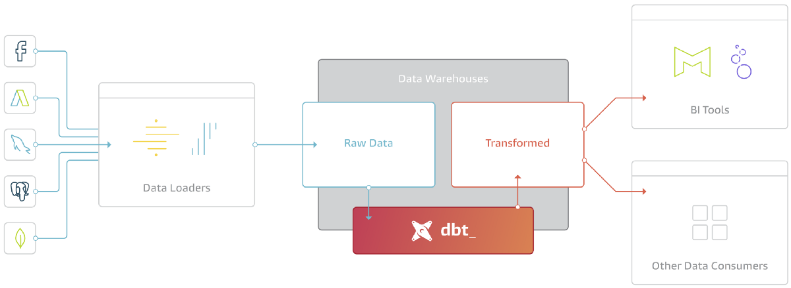

# 04 Analytics engineering

Course note created by course peer of previous cohorts:
🗒️<https://github.com/ziritrion/dataeng-zoomcamp/blob/c4447687719f76ca04cedfcc1ac8f8ad23eb0cde/notes/4_analytics.md> 

## dbt(Data Build Tool) crash course for beginners: Zero to Hero

🎞️ <https://youtu.be/C6BNAfaeqXY?feature=shared> (other resource outside of course)

Docker images for dbt: https://github.com/dbt-labs/dbt-core/pkgs/container/dbt-core




Supported data plattforms by dbt: <https://docs.getdbt.com/docs/supported-data-platforms>

`dbt` key concepts:
- Models (SQL statements)
    - Defined in `.sql` files
    - Can reference other models or tables in data warehouse
    - Model names are the file names
- Macros
    - Simplifying reusing SQL code fragments across models
- Tests (two primary ways of defining dbt tests)
    - Generic
        - Out of the box tests that can be applied across multiple data models
    - Singular
        - Custom tests are for a specific model
- Snapshots
    - Track changes in data over time

### dbt Cloud and BigQuery

Prerequisites:

- dbt Cloud Account
- GCP Account
- GCP Project
- BigQuery set up
- Github account

#### dbt Cloud Account

1. Got to <https://www.getdbt.com/> and create an account.
1. Log in to dbt Cloud and create a new project
    - With the free account there is a default project and it is not possible to create a new one.
1. Select connection, here BigQuery
1. Add service account `JSON` file
    - How to get service account `JSON`
        1. Go to GCP console
        1. Go to `IAM & Admin` > `Service accounts`
        1. Click `Create service account` and name it (e.g. `dbt-service-account`) and add role (here `Owner`, but should get restricted permissions in production environment)
        1. After creation click on the account and select the `KEYS` tab and select `ADD KEY 🔽 > Create new key` then select `JSON`
    - Upload downloaded `JSON` file to dbt Cloud using `Upload a Service Account JSON file`, this will fill in fields automatically
1. Development credentials
    - Specified `Dataset` name will be used in BigQuery, this dataset name will be used in the further up specified project name in BigQuery
1. Click `Test connection`
1. Click `Next`
1. Link code repository to dbt Cloud
    - Select `Github` and authorize dbt Cloud to access the repository


    
## In general instructions

<https://github.com/DataTalksClub/data-engineering-zoomcamp/tree/main/04-analytics-engineering>


## 4.1.1 - Analytics Engineering

🎞️ <https://youtu.be/uF76d5EmdtU?feature=shared>

## 4.1.2 - What is dbt?

🎞️ <https://youtu.be/gsKuETFJr54?feature=shared>

## 4.2.1 - 4.2.1 - Start Your dbt Project BigQuery and dbt Cloud (Alternative A)

🎞️ <https://youtu.be/J0XCDyKiU64?feature=shared>

DBT project can get created in a subdiretory of the GitHub repository, this can get specified in `Project details > Project subdirectory` in dbt cloud.
DBT will be on the default branch of the repository in `read-only` mode, to allow dbt cloud to make changes creating a new branch from dbt cloud is necessary.
In the project settings `Setup a repository` access can be granted to a specific repository. Furthermore a sub directory can be specified.

From the menu in the dbt cloud select `Develop 🔽 > Cloud IDE` 

- There will be an error message regarding a missing environment. Create it as development and do not specify a branch.
- In GitHub create a new branch, e.g. `dev-dbt`
- Click again on `Develop 🔽 > Cloud IDE` 
- Change the branch to the newly created branch `dev-dbt`
- Initialize the project and then commit the changes
- In the `dbt_project.yml` edit the name and model and remove the indicated `models` section below
     ```yml
    name: 'taxi_rides_ny'
    # ...
    models:
        taxi_rides_ny:
            # delete everything here
    ```
- In the command bar (bottom) run `dbt build` (there is an error message, but it seems not relevant at the moment, also ignored in the video)
- Commit changes

## Start Your dbt Project: Postgres and dbt Core Locally (Alternative B)

Additional resources

- dbt with BigQuery on Docker<br>
<https://github.com/DataTalksClub/data-engineering-zoomcamp/blob/main/04-analytics-engineering/docker_setup/README.md>
<br>or<br>
<https://docs.getdbt.com/docs/core/docker-install>

- dbt with Docker<br>
<https://docs.getdbt.com/docs/core/docker-install>

- dbt with BigQuery on Docker<br>
    - <https://github.com/dbt-labs/dbt-bigquery/pkgs/container/dbt-bigquery>
    -


🎞️ <https://youtu.be/1HmL63e-vRs?feature=shared>

